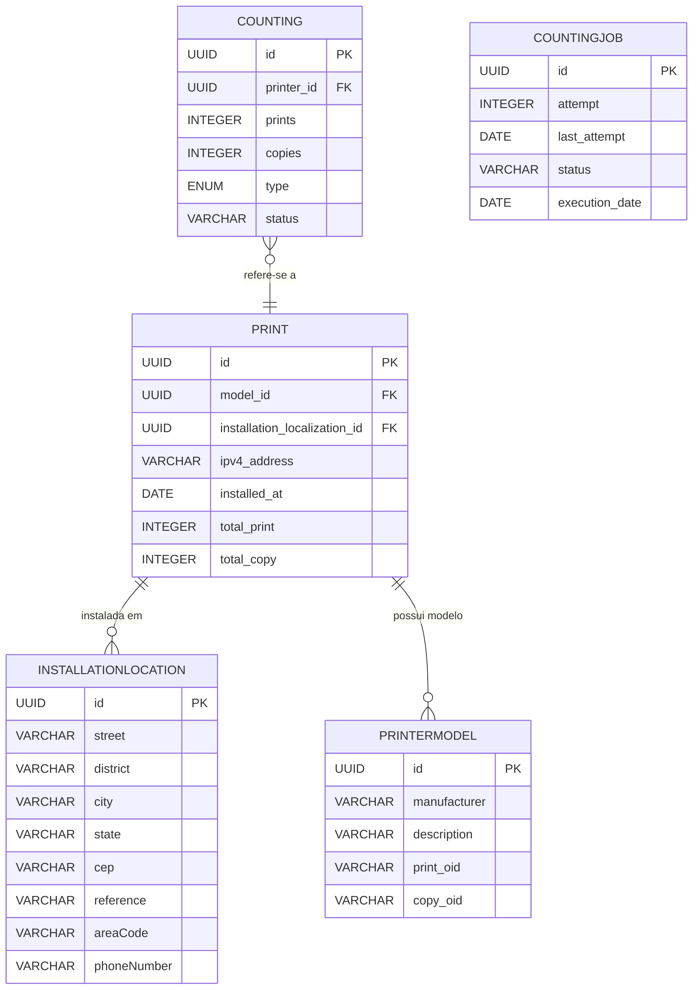

# Modelagem de dados

## Tabelas

### Print

| Campo                        | Tipo        | Descrição                         |
| ---------------------------- | ----------- | --------------------------------- |
| id                           | UUID        | Identificador único da impressora |
| model_id                     | UUID        | FK para a tabela de modelos       |
| installation_localization_id | UUID        | FK para a tabela de localizações  |
| ipv4_address                 | VARCHAR(15) | Endereço IP da impressora         |
| installed_at                 | DATE        | Data de instalação da impressora  |
| total_print                  | INTEGER     | Total de impressões               |
| total_copy                   | INTEGER     | Total de cópias                   |

### InstallationLocation

| Campo       | Tipo         | Descrição                          |
| ----------- | ------------ | ---------------------------------- |
| id          | UUID         | Identificador único da localização |
| street      | VARCHAR(255) | Rua                                |
| district    | VARCHAR(255) | Bairro                             |
| city        | VARCHAR(255) | Cidade                             |
| state       | VARCHAR(255) | Estado                             |
| cep         | VARCHAR(255) | Cep                                |
| reference   | VARCHAR(255) | Referência                         |
| areaCode    | VARCHAR(255) | Código de área                     |
| phoneNumber | VARCHAR(255) | Número de telefone                 |

### PrinterModel

| Campo                 | Tipo         | Descrição                         |
| --------------------- | ------------ | --------------------------------- |
| id                    | UUID         | Identificador único do modelo     |
| manufacturer ricantme | VARCHAR(100) | Fabricante da impressora          |
| description           | VARCHAR(255) | Nome ou descrição do modelo       |
| print_oid             | VARCHAR(255) | OID SNMP para total de impressões |
| copy_oid              | VARCHAR(255) | OID SNMP para total de cópias     |

### Counting

| Campo      | Tipo        | Descrição                                  |
| ---------- | ----------- | ------------------------------------------ |
| id         | UUID        | Identificador único da contagem            |
| printer_id | UUID        | FK para a impressora                       |
| prints     | INTEGER     | Quantidade total de impressões registradas |
| copies     | INTEGER     | Quantidade total de cópias registradas     |
| type       | ENUM        | Tipo de coleta, manual ou automatica       |
| status     | VARCHAR(50) | Status da contagem (ex: válida, pendente)  |

### CountingJob

| Campo          | Tipo        | Descrição                                 |
| -------------- | ----------- | ----------------------------------------- |
| id             | UUID        | Identificador único da contagem           |
| attempt        | INTEGER     | Quantidade de tentativas de coleta        |
| last_attempt   | DATE        | Data/hora da última tentativa de coleta   |
| status         | VARCHAR(50) | Status da contagem (ex: válida, pendente) |
| execution_date | DATE        | Data/hora da última execução              |

## Diagrama Entidade Relacionamento

---

## Change log

| Data       | Versão | Responsável     |
| ---------- | ------ | --------------- |
| 18-08-2025 | 02     | Anderson Vieira |

---
