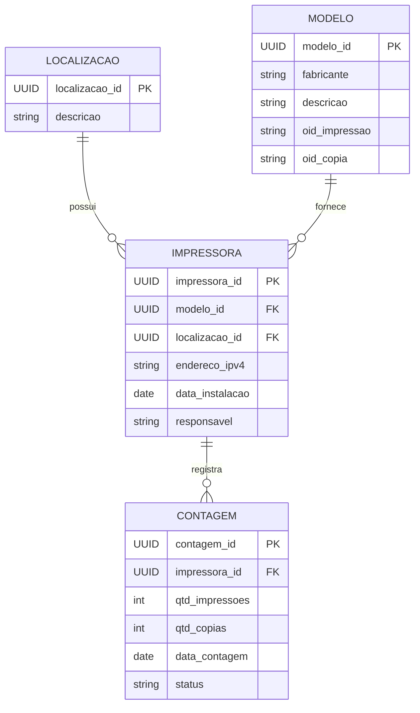

# Modelagem de dados

## Tabelas

### Impressora

| Campo           | Tipo         | Descrição                         |
| --------------- | ------------ | --------------------------------- |
| impressora_id   | UUID         | Identificador único da impressora |
| modelo_id       | UUID         | FK para a tabela de modelos       |
| localizacao_id  | UUID         | FK para a tabela de localizações  |
| endereco_ipv4   | VARCHAR(15)  | Endereço IP da impressora         |
| data_instalacao | DATE         | Data de instalação da impressora  |
| responsavel     | VARCHAR(255) | Nome do responsável               |

### Modelo

| Campo         | Tipo         | Descrição                         |
| ------------- | ------------ | --------------------------------- |
| modelo_id     | UUID         | Identificador único do modelo     |
| fabricante    | VARCHAR(100) | Fabricante da impressora          |
| descricao     | VARCHAR(255) | Nome ou descrição do modelo       |
| oid_impressao | VARCHAR(255) | OID SNMP para total de impressões |
| oid_copia     | VARCHAR(255) | OID SNMP para total de cópias     |

### Contagem

| Campo          | Tipo        | Descrição                                  |
| -------------- | ----------- | ------------------------------------------ |
| contagem_id    | UUID        | Identificador único da contagem            |
| impressora_id  | UUID        | FK para a impressora                       |
| qtd_impressoes | INTEGER     | Quantidade total de impressões registradas |
| qtd_copias     | INTEGER     | Quantidade total de cópias registradas     |
| data_contagem  | DATE        | Data em que a contagem foi registrada      |
| status         | VARCHAR(50) | Status da contagem (ex: válida, pendente)  |

### Localização

| Campo          | Tipo         | Descrição                          |
| -------------- | ------------ | ---------------------------------- |
| localizacao_id | UUID         | Identificador único da localização |
| descricao      | VARCHAR(255) | Nome, setor ou sala                |

## Diagrama Entidade Relacionamento

---

## Change log

| Data       | Versão | Responsável     |
| ---------- | ------ | --------------- |
| 05-08-2025 | 01     | Anderson Vieira |

---
