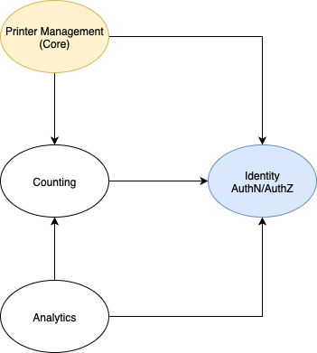
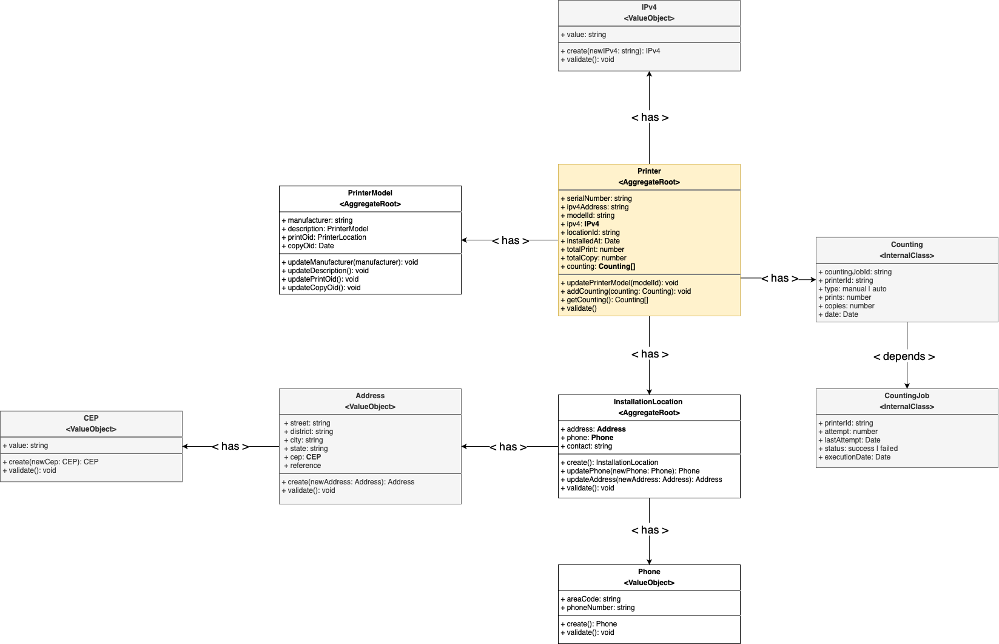

# Modelagem de dominio

## Bounded Contexts

1. Printer Management

Responsável por registrar e manter os dados de impressoras, seus modelos e suas localizações.
Entidades principais: Printer, PrinterModel, InstallationLocation.

2. Counting

Responsável por registrar os dados coletados periodicamente das impressoras.
Entidades principais: Counting, CountingJob.

3. Relatórios

Responsável por gerar análises, gráficos, alertas etc. Não deve ter Aggregate Root próprio — é mais um contexto de consulta/projeção (read-model).

## Diagramas

### **Contextos**

### **Modelos de domínio**

---

## Change log

| Data       | Versão | Responsável     |
| ---------- | ------ | --------------- |
| 18-08-2025 | 02     | Anderson Vieira |

---
